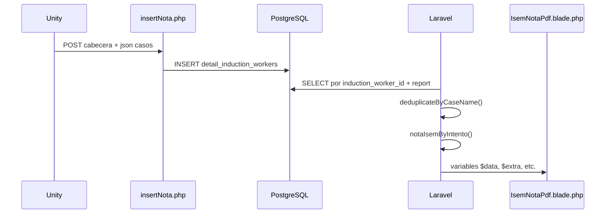

# Reporte ISEM — Implementación actual (estado del código)

Documento de referencia con **nombres de variables y archivos reales** del proyecto, sin renombrar nada.  
Sirve para alinear correcciones en Unity y cambios futuros en Laravel **sin romper la vista**.

---

## 1. Flujo general



| Paso | Archivo | Qué hace |
|------|---------|----------|
| 1 | `public/apiunity/insertNota.php` | Unity guarda el intento y cada caso |
| 2 | `detail_induction_workers` | Una fila por caso enviado |
| 3 | `SupervisorController` | Arma datos y genera PDF |
| 4 | `resources/views/ReportesFormatos/IsemNotaPdf.blade.php` | Maquetación del reporte |

**Ruta para ver PDF en navegador:**

```
GET view/pdf/{id_induction_worker}/{intento}/{entrenamiento}
→ SupervisorController::visualizar_reporte_notas()
```

Empresas ISEM (usan `IsemNotaPdf`): `id_company` **2**, **7** u **8**.

---

## 2. Entrada desde Unity — `insertNota.php`

### 2.1 Campos POST (cabecera)

| Variable PHP (`$_POST`) | Guardado en |
|------------------------|-------------|
| `cabecera_id` | `detail_induction_workers.induction_worker_id` |
| `intento` | `detail_induction_workers.report` |
| `note` | Cada fila `note` |
| `note_reference` | Cada fila `note_reference` (mismo valor en todo el intento) |
| `start_date` | Cada fila `start_date` |
| `end_date` | Cada fila `end_date` |
| `rol` | Cada fila `rol` |
| `entrenamiento` | Cada fila `entrenamiento` (`0` evaluación, `1` entrenamiento) |
| `json` | Se decodifica y se recorre; ver abajo |

Log de auditoría: `public/apiunity/error.log` (función `logMessage`).

### 2.2 JSON de casos — cómo lo procesa hoy el PHP

```php
$jsonData = json_decode($jsonData, true);
foreach ($jsonData as $item) { ... }
```

Acepta:

- **Objeto** con claves `caso0`, `caso1`, … (formato habitual Unity ISEM Altura).
- **Arreglo** de objetos (también funciona con `foreach`).

Por cada `$item` inserta en `detail_induction_workers`:

| Campo BD | Origen |
|----------|--------|
| `case` | `$item['case']` |
| `identified` | `$item['identified']` |
| `risk_level` | `$item['risk_level']` |
| `correct_measure` | `$item['correct_measure']` |
| `time` | `$item['time']` |
| `difficulty` | `$item['difficulty']` |
| `num_errors` | `$item['num_errors']` |
| `json` | `json_encode($item['json'])` ← ver nota abajo |

**Nota importante:** En el JSON ISEM actual **no viene** subclave `json` dentro de cada caso; el ítem es plano. Entonces `json_encode($item['json'])` suele guardar `null` en columna `json`. Los datos útiles están en las columnas `case`, `identified`, `time`, etc.

**No hay deduplicación en `insertNota.php`:** si Unity envía el mismo `case` dos veces, se insertan **dos filas** en BD.

### 2.3 Ejemplo real (log) — Trabajos en Altura

```json
{
  "caso0": {"case":"Delimitar la zona de trabajo.","identified":"0","risk_level":"0","correct_measure":"0","time":"0:0","difficulty":"Alto"},
  "caso1": {"case":"Delimitar la zona de trabajo.","identified":"1","risk_level":"0","correct_measure":"0","time":"0:0","difficulty":"Alto"},
  "caso2": {"case":"Verificación de preuso de arnes.","identified":"1",...},
  ...
  "caso6": {"case":"Traslado a zona de trabajo.","identified":"1",...}
}
```

Cabecera típica: `note_reference: 7`, `start_date` / `end_date` del intento.

---

## 3. Laravel — generación del PDF

### 3.1 Métodos del controlador

| Método | Uso |
|--------|-----|
| `generarPDFISem($id_induction_worker, $intento, $modo)` | Devuelve objeto PDF (descarga interna) |
| `visualizar_reporte_notas($id_induction_worker, $intento, $modo)` | Stream en navegador; para ISEM reemplaza vista por `IsemNotaPdf` |

Ambos comparten la **misma lógica de datos** para ISEM (consulta + variables).

### 3.2 Consulta de detalle

```php
$detail_induction_worker = DetailInductionWorker::where('induction_worker_id', $induction_worker->id)
    ->where('report', $intento);

// Evaluación vs entrenamiento
if ($modo == 'Entrenamiento') {
    $detail_induction_worker->where('entrenamiento', 1);
} else {
    $detail_induction_worker->where('entrenamiento', '<>', 1);
}

$detail_induction_worker = DetailInductionWorker::deduplicateByCaseName(
    $detail_induction_worker->orderBy('id', 'asc')->get()
);
```

**Deduplicación solo al leer** (reporte), no al insertar: por nombre de `case`, se queda el registro con mayor `identified + risk_level + correct_measure` (y mayor `id` si empatan).

### 3.3 Variables calculadas en el controlador

| Variable | Cómo se obtiene | Uso en PDF |
|----------|-----------------|------------|
| `$casosTotales` | `$induction_worker->case_count` | Se pasa a la vista pero **no se usa** en “Pasos” (ahí está fijo `8`) |
| `$casosBuenos` | Conteo de filas con `identified != 0` (tras deduplicar) | “Pasos Realizados” y gráfico |
| `$casosMalos` | **`8 - $casosBuenos`** (hardcode) | Gráfico dona “No encontrados” |
| `$data` (primer uso) | `$detail_induction_worker[0]` | Primer registro del detalle |
| `$data` (segundo uso) | **Array** pasado a la vista | Contiene claves listadas abajo |

Luego se sobrescribe parte del array con `notaIsemByIntento`:

```php
$datas = $induction_worker->notaIsemByIntento($intento);

$data['ponderado'] = 1;
$data['porcentaje'] = $datas['porcentaje'];
$data['categoria'] = $datas['categoria'];
$data['nota'] = $datas['total_sum'];
$data['extra'] = $datas;
```

### 3.4 Array `$data` enviado a `IsemNotaPdf` (nombres exactos)

| Clave en vista | Contenido |
|----------------|-----------|
| `$induction_worker` | Modelo `InductionWorker` |
| `$worker` | Modelo `Worker` |
| `$induction` | Modelo `Induction` |
| `$detail_induction_worker` | Colección de `DetailInductionWorker` (deduplicada) |
| `$data` | **Primer registro** del detalle (`DetailInductionWorker`) — clave `'data'` del array |
| `$casosTotales` | `case_count` del trabajador |
| `$casosBuenos` | int |
| `$casosMalos` | int |
| `$logo` | URL imagen empresa |
| `$logo_taller` | Foto del taller (`$induction->workshop->photo`) |
| `$imagen` | URL QuickChart (gráfico dona) |
| `$extra` | Resultado de `notaIsemByIntento()` |
| `$intento`, `$modo`, `$intentos`, `$num_reportes` | Metadatos del reporte |

En Blade, **`$data` es el primer detalle** porque Laravel expone la clave `'data'` del array como variable `$data`.

---

## 4. `InductionWorker::notaIsemByIntento($intento)`

Archivo: `app/Models/InductionWorker.php`

1. Lee detalles del intento con `detailsByReport($intento)`.
2. Aplica **`deduplicateByCaseName`** (igual que el PDF).
3. Suma por columna:
   - `identified_sum`
   - `risk_level_sum`
   - `correct_measure_sum`
4. Toma `note_reference` del **primer** detalle tras deduplicar.
5. Calcula:

```text
total_bruto = identified_sum + risk_level_sum + correct_measure_sum
total_sum   = round((total_bruto / note_reference) * 20)
```

6. Asigna categoría según `total_sum` (Seguimiento, En Proceso, Competente, Muy Competente).

### Retorno en `$extra` (usado en la vista)

| Clave | Uso en `IsemNotaPdf.blade.php` |
|-------|--------------------------------|
| `note_reference` | Podría usarse; hoy “Nota de Referencia” usa `$data->note_reference` |
| `identified_sum` | Fila TOTAL columna Identificado |
| `risk_level_sum` | Comentado en tabla |
| `correct_measure_sum` | Comentado en tabla |
| `total_sum` | Cuadro nota X/20, categoría, aprobado |
| `porcentaje` | No mostrado directo en esta plantilla |
| `categoria` | Cuadro gris derecho superior |

**Nota obtenida en resumen:** en la vista se calcula otra vez:

```php
$totalSum = round($extra['identified_sum'] + $extra['risk_level_sum'] + $extra['correct_measure_sum']);
```

(Sin dividir por `note_reference`; es la suma bruta.)

---

## 5. Vista `IsemNotaPdf.blade.php` — sección por sección

### 5.1 Encabezado

- `$logo` — imagen empresa.
- Título fijo en HTML (texto actual del archivo).

### 5.2 Datos del usuario

| Muestra | Variable |
|---------|----------|
| DNI | `$worker->user->doi` |
| Nombre / Apellidos | `$worker->user->name`, `last_name` |
| Fecha reporte | `Carbon::now()` (no fecha del intento) |
| Nota / Aprobado / Categoría | `$extra['total_sum']`, umbral `> 12`, `$extra['categoria']` |

### 5.3 Datos de evaluación

| Muestra | Variable |
|---------|----------|
| Escenario | `$induction->alias` |
| **Pasos** | **Literal `8`** (no usa `$casosTotales`) |
| Pasos realizados | `$casosBuenos` |
| Fechas / duración | `$data->start_date`, `$data->end_date` (primer detalle) |
| Foto taller | `$logo_taller` |

`$casosTotales` está comentado en un bloque “Total de Casos”.

### 5.4 Tabla “Detalles de evaluación”

```blade
@foreach ($detail_induction_worker as $key => $data)
```

| Columna | Variable en loop |
|---------|------------------|
| Nombre | `$data->case` |
| Identificado | `$data->identified` |
| Tiempo | `date('H:i', strtotime($data->time))` |

Columnas **Nivel de riesgo** y **Medida correcta**: comentadas en HTML.

**Efecto colateral:** el `@foreach` usa **`$data` como variable de loop** y **pisa** la variable `$data` del primer detalle. Después del loop, en “Nota de Referencia” se usa `$data->note_reference`, que en realidad es el **último caso del foreach**, no el primero (suele ser el mismo `note_reference` en todas las filas).

### 5.5 Resumen inferior

| Campo | Variable actual |
|-------|-----------------|
| Nota de Referencia | `$data->note_reference` (tras foreach = última fila) |
| Nota Obtenida | `$totalSum` (suma de `$extra`) |
| Nota ponderada | `$extra['total_sum']`/20 |
| Gráfico | `$imagen` (URL QuickChart con `$casosBuenos` y `$casosMalos`) |

---

## 6. Tabla de correspondencia Unity → Reporte (estado actual)

| Dato Unity (POST / JSON) | BD | Qué muestra el PDF hoy |
|--------------------------|-----|-------------------------|
| `note_reference` | `note_reference` | Nota de referencia |
| `identified` por caso | `identified` | Tabla + suma → Nota obtenida |
| `time` por caso | `time` | Columna tiempo (`strtotime` → si viene `0:0` → `00:00`) |
| Casos en JSON | N filas | Filas tabla (menos duplicados por dedup al leer) |
| — | — | **Pasos = 8 fijo** (no lee JSON ni `case_count` en esa etiqueta) |
| `case_count` en `induction_workers` | `case_count` | Solo en variable `$casosTotales` (no visible en “Pasos”) |
| Duplicado mismo `case` | 2 filas | 1 fila tras `deduplicateByCaseName` |

---

## 7. Comportamientos / inconsistencias conocidas (sin cambiar nombres)

1. **Pasos = 8** hardcodeado en Blade; no refleja `note_reference` ni cantidad de casos en JSON.
2. **`casosMalos = 8 - casosBuenos`** hardcodeado en controlador.
3. **Duplicados en BD** si Unity los envía; el reporte los oculta al deduplicar.
4. **`time` en `0:0`** desde Unity → reporte muestra `00:00`.
5. **`$item['json']` en insertNota** no coincide con estructura ISEM → columna `json` en BD vacía.
6. **`$data` en foreach** sobrescribe el primer detalle para campos posteriores.

Cualquier mejora futura debe **mantener** los nombres `$data`, `$extra`, `$detail_induction_worker`, `$casosBuenos`, etc., salvo acuerdo explícito de refactor.

---

## 8. Qué debe enviar Unity (alineado a esta implementación)

### Cabecera POST

```
cabecera_id, intento, note, note_reference, start_date, end_date, json, entrenamiento, rol
```

### Cada caso en `json`

```json
{
  "case": "Nombre único del paso",
  "identified": "1",
  "risk_level": "0",
  "correct_measure": "0",
  "time": "2:30",
  "difficulty": "Alto"
}
```

| Campo | Recomendación |
|-------|----------------|
| `note_reference` | = puntaje máximo del intento (ej. 7 si 7 pasos de 1 punto) |
| `time` | Minutos:segundos reales; evitar `0:0` si hubo duración |
| `case` | Sin repetir el mismo nombre en un intento |

---

## 9. Pruebas con Postman / Unity

Ver guía completa de URLs, body y JSON de casos: **[POSTMAN_ISEM_UNITY_ENDPOINTS.md](./POSTMAN_ISEM_UNITY_ENDPOINTS.md)**

## 10. Archivos clave (rutas en el repo)

| Archivo |
|---------|
| `public/apiunity/insertNota.php` |
| `app/Http/Controllers/Administrator/SupervisorController.php` |
| `app/Models/InductionWorker.php` → `notaIsemByIntento()` |
| `app/Models/DetailInductionWorker.php` → `deduplicateByCaseName()` |
| `resources/views/ReportesFormatos/IsemNotaPdf.blade.php` |
| `routes/web.php` → ruta `view.pdf` |

---

*Documento generado a partir del código en repositorio tras restauración de cambios experimentales. Mantener nombres de variables al modificar.*
