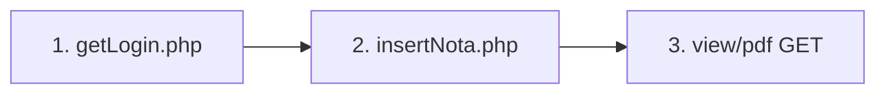

# Postman — Endpoints ISEM / Simulador Unity

Guía para probar el flujo del simulador VR contra el backend, igual que lo hace Unity.

**Base URL local (ejemplo):**

```
http://localhost:8000
```

**Base URL producción (ejemplo del proyecto):**

```
https://simuladoresvr.cursso.digital
```

Ajusta host y puerto según tu `php artisan serve` o servidor web.

---

## Flujo recomendado de prueba



| Orden | Endpoint | Para qué |
|-------|----------|----------|
| 1 | `POST .../apiunity/getLogin.php` | Obtener `cabecera_id`, `intento`, pasos del taller |
| 2 | `POST .../apiunity/insertNota.php` | Guardar evaluación + casos (como Unity al terminar) |
| 3 | `GET .../view/pdf/{cabecera_id}/{intento}/{modo}` | Ver reporte PDF en navegador |

---

## 1. Login / inducciones activas (Simulador)

### Request

| | |
|--|--|
| **Método** | `POST` |
| **URL** | `{{base_url}}/apiunity/getLogin.php` |
| **Content-Type** | `application/x-www-form-urlencoded` |

### Body (form-data o x-www-form-urlencoded)

| Campo | Tipo | Obligatorio | Ejemplo |
|-------|------|:-----------:|---------|
| `dni` | string | Sí | `46218210` |
| `id_company` | int | Sí | `2` (ISEM) |

### Respuesta exitosa (200)

```json
{
  "dni": "46218210",
  "inducciones": [
    {
      "induction_id": "12",
      "id_workshop": "5",
      "cabecera_id": "3744",
      "intento": "1",
      "intentos": "3",
      "fecha_inicio": "2026-01-01 08:00:00",
      "fecha_fin": "2026-12-31 18:00:00",
      "taller": "TRABAJOS EN ALTURA 1",
      "nombre": "Juan",
      "apellido": "Pérez",
      "pasos": [
        { "name": "Delimitar la zona de trabajo.", "duration": "120" },
        { "name": "Verificación de preuso de arnes.", "duration": "90" }
      ]
    }
  ]
}
```

**Guardar para el siguiente paso:**

- `cabecera_id` → va en `insertNota` como `cabecera_id`
- `intento` → número de intento que Unity enviará
- `pasos` → catálogo del taller (referencia; los casos reales se envían en `insertNota`)

### Alternativa Laravel (solo consulta)

| | |
|--|--|
| **Método** | `GET` |
| **URL** | `{{base_url}}/isem/v1/{dni}` |

Ejemplo: `GET http://localhost:8000/isem/v1/46218210`

Respuesta JSON con `inducciones` (sin lista `pasos` del taller como getLogin).

---

## 2. Guardar nota y casos — **endpoint principal Unity**

Este es el que usa el simulador al finalizar la evaluación (registrado en `error.log`).

### Request

| | |
|--|--|
| **Método** | `POST` |
| **URL** | `{{base_url}}/apiunity/insertNota.php` |
| **Content-Type** | `application/x-www-form-urlencoded` |

### Body — cabecera (campos POST)

| Campo | Tipo | Obligatorio | Descripción |
|-------|------|:-----------:|-------------|
| `cabecera_id` | int | **Sí** | `induction_workers.id` (de getLogin: `cabecera_id`) |
| `intento` | int | **Sí** | Número de intento (`report`) |
| `note` | string/number | **Sí** | Nota global del intento |
| `note_reference` | string/number | **Sí** | Puntaje máximo / pasos que puntúan (ej. `7`) |
| `start_date` | string | **Sí** | `YYYY-MM-DD HH:MM:SS` |
| `end_date` | string | **Sí** | `YYYY-MM-DD HH:MM:SS` |
| `rol` | string | No | Puede ir vacío `""` |
| `entrenamiento` | int | **Sí** | `0` = evaluación, `1` = entrenamiento |
| `json` | **string** | **Sí** | JSON de casos **como texto** (ver abajo) |

> **Postman:** en el campo `json` pega el JSON **completo en una sola línea** o usa comillas escapadas. No uses tipo `File` salvo que sea texto plano.

---

### Estructura del campo `json` — cada paso/caso

Unity envía un **objeto** con claves `caso0`, `caso1`, … o un **arreglo** de objetos. Ambos funcionan.

#### Formato A — Objeto (como el simulador actual)

```json
{
  "caso0": {
    "case": "Delimitar la zona de trabajo.",
    "identified": "1",
    "risk_level": "0",
    "correct_measure": "0",
    "time": "1:30",
    "difficulty": "Alto"
  },
  "caso1": {
    "case": "Verificación de preuso de arnes.",
    "identified": "1",
    "risk_level": "0",
    "correct_measure": "0",
    "time": "2:15",
    "difficulty": "Alto"
  },
  "caso2": {
    "case": "Inspección de andamios.",
    "identified": "1",
    "risk_level": "0",
    "correct_measure": "0",
    "time": "0:55",
    "difficulty": "Alto"
  },
  "caso3": {
    "case": "Subida a segundo nivel.",
    "identified": "1",
    "risk_level": "0",
    "correct_measure": "0",
    "time": "3:10",
    "difficulty": "Alto"
  },
  "caso4": {
    "case": "Subida a tercer nivel.",
    "identified": "1",
    "risk_level": "0",
    "correct_measure": "0",
    "time": "2:05",
    "difficulty": "Alto"
  },
  "caso5": {
    "case": "Traslado a zona de trabajo.",
    "identified": "1",
    "risk_level": "0",
    "correct_measure": "0",
    "time": "1:20",
    "difficulty": "Alto"
  }
}
```

#### Formato B — Arreglo (recomendado para pruebas)

```json
[
  {
    "case": "Delimitar la zona de trabajo.",
    "identified": "1",
    "risk_level": "0",
    "correct_measure": "0",
    "time": "1:30",
    "difficulty": "Alto"
  },
  {
    "case": "Verificación de preuso de arnes.",
    "identified": "1",
    "risk_level": "0",
    "correct_measure": "0",
    "time": "2:15",
    "difficulty": "Alto"
  }
]
```

#### Campos de cada paso

| Campo | Tipo | Obligatorio | Descripción |
|-------|------|:-----------:|-------------|
| `case` | string | **Sí** | Nombre del paso (único por intento) |
| `identified` | string | **Sí** | `1` = identificado, `0` = no |
| `risk_level` | string | **Sí** | En ISEM Altura suele ser `"0"` |
| `correct_measure` | string | **Sí** | En ISEM Altura suele ser `"0"` |
| `time` | string | **Sí** | Duración **`minutos:segundos`** (ej. `"2:30"`, no `"0:0"` si hubo tiempo) |
| `difficulty` | string | Recomendado | Ej. `"Alto"`, `"Bajo"` |
| `num_errors` | string/number | No | Si no se envía, puede fallar el bind en PHP; usar `"0"` |

**No existe** sub-objeto `json` dentro de cada caso en ISEM; el tiempo va en `time` al mismo nivel.

---

### Ejemplo completo Postman (x-www-form-urlencoded)

| Key | Value |
|-----|-------|
| `cabecera_id` | `3744` |
| `intento` | `1` |
| `note` | `0` |
| `note_reference` | `7` |
| `start_date` | `2026-04-24 08:08:46` |
| `end_date` | `2026-04-24 08:12:46` |
| `rol` | |
| `entrenamiento` | `0` |
| `json` | *(pegar JSON de casos en una línea)* |

**Valor de `json` en una línea (ejemplo):**

```
{"caso0":{"case":"Delimitar la zona de trabajo.","identified":"1","risk_level":"0","correct_measure":"0","time":"1:30","difficulty":"Alto"},"caso1":{"case":"Verificación de preuso de arnes.","identified":"1","risk_level":"0","correct_measure":"0","time":"2:15","difficulty":"Alto"}}
```

### Respuestas

**Éxito:**

```json
{"success":"Actualización exitosa. Se insertaron 7 casos."}
```

**Error intentos:**

```json
{"error":"Supero el numero de intentos permitidos, Te excediste"}
```

**Error cabecera vacía:**

```json
{"error":"Error en la consulta: ... invalid input syntax for type bigint: \"\" ..."}
```

**Reporte ya existe:**

```json
{"error":"Ya existe un reporte generado para este intento"}
```

### Auditoría

Revisa `public/apiunity/error.log` — cada POST queda registrado con `jsonData` completo.

---

## 3. Ver reporte PDF (Laravel)

Después de `insertNota` exitoso:

| | |
|--|--|
| **Método** | `GET` |
| **URL** | `{{base_url}}/view/pdf/{cabecera_id}/{intento}/{modo}` |

| Parámetro | Valor |
|-----------|--------|
| `cabecera_id` | Mismo `cabecera_id` |
| `intento` | Mismo `intento` |
| `modo` | `Evaluación` o `Entrenamiento` (texto exacto) |

**Ejemplo:**

```
GET http://localhost:8000/view/pdf/3744/1/Evaluación
```

Abre el PDF en el navegador. Empresas ISEM: `id_company` 2, 7 u 8.

---

## 4. Endpoints auxiliares

### 4.1 Contar / listar detalle por cabecera

| | |
|--|--|
| **Método** | `POST` |
| **URL** | `{{base_url}}/apiunity/getCountInduction.php` |
| **Body** | `induction_worker_id=3744` |

Respuesta: `{ "induction": [ filas de detail_induction_workers ] }`

### 4.2 Insertar un solo caso (legacy)

| | |
|--|--|
| **Método** | `POST` |
| **URL** | `{{base_url}}/apiunity/insertCasos.php` |

| Campo | Ejemplo |
|-------|---------|
| `induction_worker` | `3744` |
| `case` | `Paso de prueba` |
| `identified` | `1` |
| `risk_level` | `0` |
| `correct_measure` | `0` |
| `time` | `2:30` |
| `difficulty` | `Alto` |

No reemplaza `insertNota` para un intento completo.

---

## 5. Rutas Laravel `isem/v1` (no son el POST de Unity)

⚠️ **No confundir** con `apiunity/insertNota.php`.

| Método | URL | Uso |
|--------|-----|-----|
| `GET` | `/isem/v1/{dni}` | Inducciones activas worker ISEM |
| `GET` | `/isem/v1/insertcasos/{json}` | Un caso en URL (JSON URL-encoded) |
| `GET` | `/isem/v1/insertnota/{json}` | Actualiza cabecera `induction_workers` y **borra** detalles |

### Ejemplo `insertnota` Laravel (GET) — solo cabecera

URL (JSON en path, URL-encoded):

```
GET {{base_url}}/isem/v1/insertnota/%7B%22id_worker%22%3A13%2C%22id_induction%22%3A5%2C%22note%22%3A%2218.9%22%2C%22reference_note%22%3A%2220%22%2C%22case_count%22%3A8%2C%22shift%22%3A%22Dia%22%2C%22start_date%22%3A%222023-08-31%22%2C%22end_date%22%3A%222023-09-15%22%7D
```

JSON decodificado:

```json
{
  "id_worker": 13,
  "id_induction": 5,
  "note": "18.9",
  "reference_note": "20.00",
  "case_count": 8,
  "shift": "Dia",
  "start_date": "2023-08-31",
  "end_date": "2023-09-15"
}
```

Esto **no envía** los casos del simulador; solo actualiza `case_count` y elimina filas previas de detalle.

---

## 6. Variables Postman sugeridas

| Variable | Ejemplo |
|----------|---------|
| `base_url` | `http://127.0.0.1:8000` |
| `dni` | `46218210` |
| `id_company` | `2` |
| `cabecera_id` | `3744` |
| `intento` | `1` |

---

## 7. Colección rápida — checklist Postman

### Request 1 — Login simulador

```
POST {{base_url}}/apiunity/getLogin.php
Body: dni={{dni}}&id_company={{id_company}}
```

### Request 2 — Guardar evaluación (Unity)

```
POST {{base_url}}/apiunity/insertNota.php
Body: cabecera_id, intento, note, note_reference, start_date, end_date, rol, entrenamiento, json
```

### Request 3 — PDF

```
GET {{base_url}}/view/pdf/{{cabecera_id}}/{{intento}}/Evaluación
```

---

## 8. Reglas para que el reporte cuadre

| Dato | Regla |
|------|--------|
| Pasos totales | `note_reference` o `case_count` = cantidad de pasos del escenario |
| Casos en `json` | Un `case` por paso, sin duplicar nombre |
| `time` | Cronómetro real `M:S` por paso |
| `note_reference` | = puntaje máximo (ej. 7 pasos × 1 punto = `7`) |
| `identified` | `1` si el usuario completó/identificó el paso |

---

## 9. Archivos relacionados

| Archivo | Rol |
|---------|-----|
| `public/apiunity/getLogin.php` | Login + inducciones + pasos taller |
| `public/apiunity/insertNota.php` | **Guardado principal Unity** |
| `public/apiunity/error.log` | Log de requests |
| `routes/web.php` | `view/pdf`, rutas `isem/v1` |
| `docs/ISEM_IMPLEMENTACION_ACTUAL.md` | Cómo Laravel arma el PDF |

---

*Documento para pruebas Postman — Simulador VR ISEM.*
